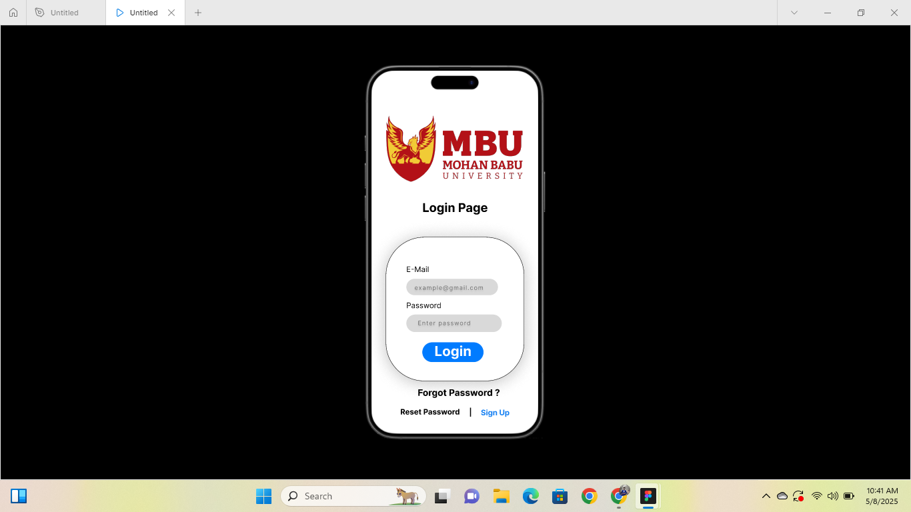
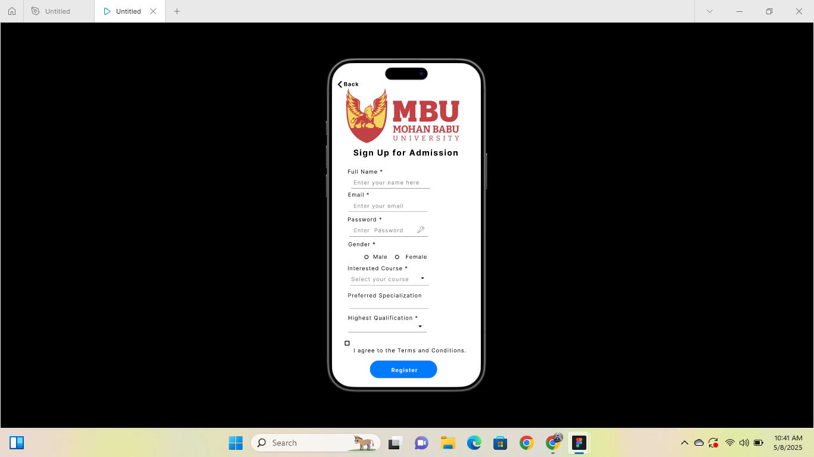
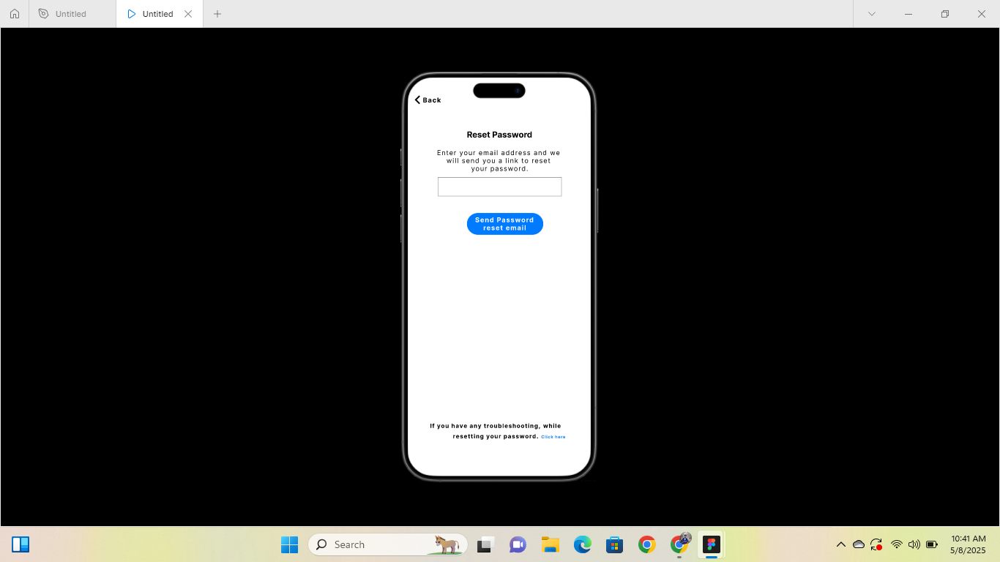
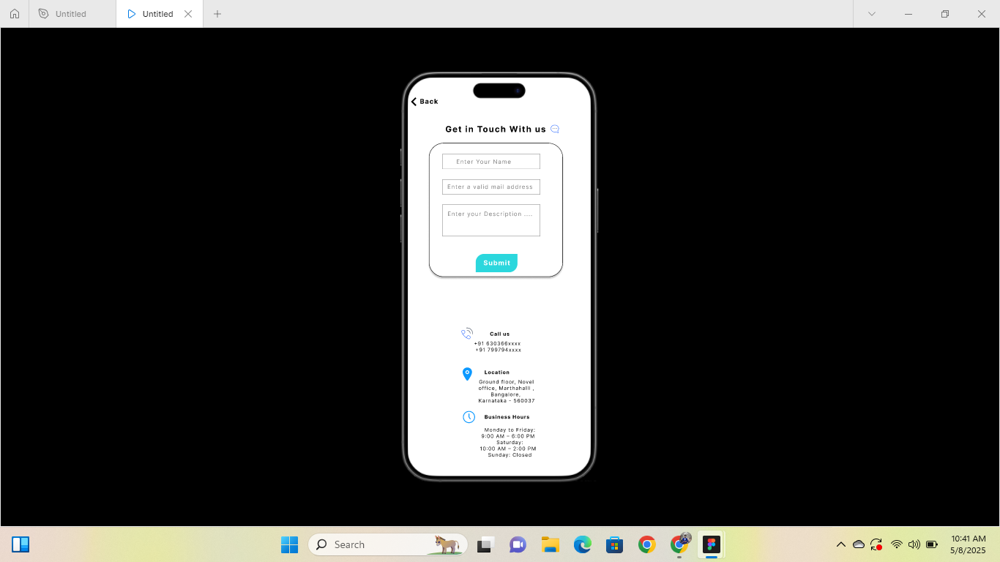
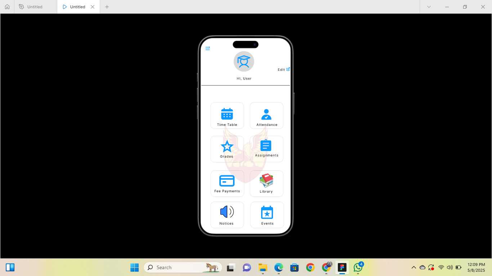

# 📱 College App UI/UX Design

This repository showcases the user interface (UI) and user experience (UX) designs created in Figma for a mobile college application.

The design focuses on providing a simple and clean experience for new users and existing students, covering the essential user authentication and contact features.

---

## 🔗 Live Preview

👉 [Click here to view the Figma Design](https://www.figma.com/proto/z8gk5564DquZAPeRQ54v5b/Untitled?page-id=0%3A1&node-id=9-60&p=f&viewport=977%2C296%2C0.31&t=0Ijzjn4GKWJImDdJ-1&scaling=scale-down&content-scaling=fixed&starting-point-node-id=9%3A60)

---

## 🖼️ Screens Included

### 🔐 Login Page
A clean login screen with fields for email and password, along with a "Forgot Password" option.

### 🆕 Signup Page
A registration interface where new users can sign up with details like name, email, and password.

### 🔄 Reset Password Page
A minimal page allowing users to securely reset their password via email.

### 📞 Contact Us Page
A form where users can send messages or reach out to the app’s support team, with fields like name, email, subject, and message.

### 🏠 After Login Page  
The dashboard/home screen shown after successful login.

---

## 📸 Screenshots

### 🔐 Login

### 🆕 Signup

### 🔄 Reset Password

### 📞 Contact Us

### 🏠 After Login Page

